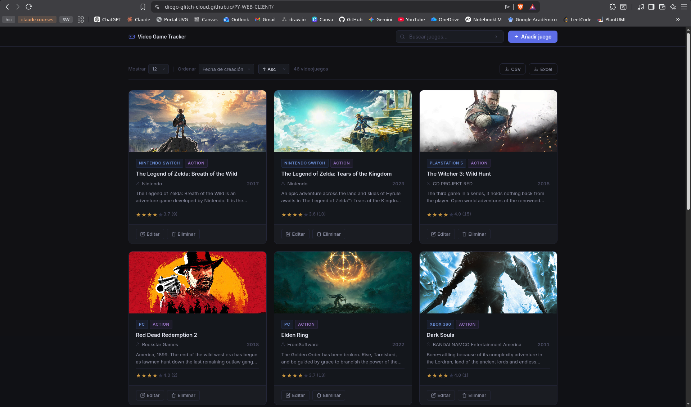

# Video Game Tracker — Frontend Client

Aplicación web interactiva para la gestión de un catálogo de videojuegos. Construida con **HTML5, CSS3 y JavaScript Vanilla** sin frameworks externos. Presenta un diseño moderno "Dark Glassmorphism", animaciones fluidas y comunicación asíncrona con la API REST del backend.

**Repositorio del backend:** https://github.com/Diego-glitch-cloud/PY-WEB-BACKEND  
**API en producción (Railway):** https://py-web-backend-production.up.railway.app
**Aplicación en producción (GitHub Pages):** https://diego-glitch-cloud.github.io/PY-WEB-CLIENT/

---

## Screenshot



---

## Requisitos previos

- Un navegador web moderno (Chrome, Firefox, Safari, Edge).
- Conexión a internet (para cargar Google Fonts y conectar con el backend en la nube).
- *(Opcional)* Servidor HTTP simple si se corre localmente (ej: `Live Server` en VSCode o `python3 -m http.server`).

---

## Cómo correr localmente

### 1. Clonar el repositorio

```bash
git clone https://github.com/Diego-glitch-cloud/PY-WEB-CLIENT.git
cd PY-WEB-CLIENT
```

### 2. Configurar la API URL

Por defecto, el archivo `js/config.js` está preparado para conectarse al backend en producción (Railway). Si deseas ejecutar contra tu propio servidor local, debes editarlo:

```javascript
const CONFIG = {
    // API_URL: "https://py-web-backend-production.up.railway.app", // Entorno de producción
    API_URL: "http://localhost:8080", // Descomentar para desarrollo local
    DEFAULT_LIMIT: 12
};
```

### 3. Levantar la aplicación

Como es puro Vanilla JS, HTML y CSS, basta con abrir el archivo `index.html` en tu navegador:

```bash
# En macOS
open index.html

# En Linux
xdg-open index.html

# En Windows
start index.html
```

*(Recomendación: usar la extensión "Live Server" de VSCode para tener recarga automática al hacer cambios).*

---

## Características y Funcionalidades

- **CRUD Completo:** Listar, crear, editar y eliminar videojuegos interactuando con una API REST.
- **Diseño Premium:** Estética oscura moderna (*Dark Mode*), uso de *Glassmorphism* (fondos traslúcidos y desenfoque), animaciones fluidas con `cubic-bezier`, y feedback visual (*Toasts* de éxito/error).
- **Tipografía y Estilos:** Integración de Google Fonts (`Inter` y `Space Grotesk`) y manejo de múltiples variables CSS.
- **Paginación y Filtrado:** Controles para límite de resultados, ordenamiento (fechas, género, año) y búsqueda dinámica en tiempo real utilizando la técnica de *Debounce*.
- **Subida de Imágenes:** Soporte para subir imágenes físicas al servidor (`FormData`) o proveer una URL directa, ofreciendo vista previa reactiva.
- **Sistema de Calificaciones:** Componente interactivo de "Estrellas" (Stars Rating) diseñado de cero, que envía la calificación y actualiza instantáneamente el DOM de la aplicación sin recargar.

---

## Estructura del proyecto

```text
PY-WEB-CLIENT/
├── index.html             # Estructura base de la UI, modales y formularios
├── css/
│   └── styles.css         # Diseño global, clases utilitarias, animaciones y UI responsiva
├── js/
│   ├── config.js          # Configuración de entorno (API URL)
│   ├── api.js             # Módulo HTTP: Peticiones asíncronas con Fetch API
│   ├── ui.js              # Manipulación del DOM, creación de elementos, componentes y feedback (Toasts)
│   └── app.js             # Controlador principal: Estado global, listeners y lógica de negocio
└── README.md              # Documentación del proyecto (Este archivo)
```

---

## Challenges implementados (Frontend)

De acuerdo con la rúbrica del proyecto, se integraron los siguientes retos a nivel de frontend:

| Challenge | Descripción |
|-----------|-------------|
| **Calidad visual y UX** | Uso de variables CSS, flexbox/grid avanzado, modales de confirmación personalizados, *spinners* de carga para estados vacíos/de espera, diseño responsivo y sin componentes con apariencia "por defecto". |
| **Exportación CSV** | Lógica nativa en JS puro para solicitar los resultados enteros a la API, iterarlos, formatear las cabeceras/columnas, escapar caracteres especiales y construir un `Blob` descargable de forma local en el navegador. |
| **Exportación Excel** | Creación manual de un esquema de hoja de cálculo estructurado en Open XML, convirtiéndolo dinámicamente a formato `application/vnd.ms-excel` (`.xls`) sin utilizar librerías de terceros (npm). |
| **Componente de Ratings** | Desarrollo de estrellas dinámicas que escuchan eventos (hover, click) usando manipulación pura de clases. Envía el POST a la API y sobreescribe inmediatamente el HTML interno con el nuevo promedio y votos (Reactividad Vanilla). |
| **Organización de Código** | Separación arquitectónica estricta: configuración, red (`api`), vistas/componentes (`ui`) y controladores de eventos y estado global (`app`). |

---

## Reflexión

Desarrollar una aplicación interactiva robusta utilizando **exclusivamente JavaScript Vanilla, CSS puro y HTML5**, sin el auxilio de librerías modernas de UI (como React o Vue) ni frameworks de CSS (como Tailwind o Bootstrap), resultó ser un reto técnico profundamente enriquecedor. Esta restricción forzó una reconexión directa con las bases fundamentales del desarrollo web y la API nativa del navegador.

Uno de los principales aprendizajes fue el **manejo manual del estado y del ciclo de vida del DOM**. Trabajar con el objeto global `state = { page, limit, sort, q }` exigió ser sumamente meticuloso respecto a cuándo y cómo invocar a las funciones de actualización (`renderGames()`), recordando limpiar eventos huérfanos e inyectar *spinners* o estados vacíos para evitar inconsistencias en la UI. 

Adicionalmente, implementar la lógica de **descarga de archivos (CSV / Excel)** construyendo Blobs desde el navegador fue una lección invaluable sobre el manejo de streams de datos en el cliente. Realizar esto de forma nativa —escapando cadenas de texto manualmente y manipulando esquemas de *Open XML*— demostró el inmenso poder subyacente que tiene JavaScript, demostrando que en muchos casos se abusa del uso de dependencias externas.

Finalmente, diseñar una interfaz premium aplicando tendencias como el *Glassmorphism* y animaciones complejas (transiciones *hover* progresivas y transformaciones `cubic-bezier`) reforzó que la percepción de calidad ("UX/UI") recae enormemente en el pulido de micro-interacciones. Pequeños detalles como deshabilitar el botón de "Guardar" mientras se procesa la solicitud asíncrona o brindar feedback instantáneo mediante *Toasts* son la diferencia fundamental entre un prototipo escolar y una plataforma de uso profesional.

**¿Usaría esta tecnología de nuevo?** 
Creo que sí lo usaría, pero prefiero utilizar algún framework como react para el desarrollo frontend ya que agiliza mucho el proceso de desarrollo.

Repositorio Backend: https://github.com/Diego-glitch-cloud/PY-WEB-BACKEND